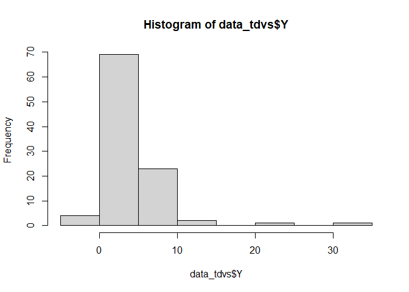

<!-- README.md is generated from README.Rmd. Please edit that file -->

# TDVS

<!-- badges: start -->

<!-- badges: end -->

**TDVS** is an R package for *Testing-driven Variable Selection in
Bayesian Modal Regression*. It implements efficient Bayesian variable
selection methods based on a permutation-based hypothesis testing.

## Installation

You can install the development version of TDVS from
[GitHub](https://github.com/) with:

``` r
# install.packages("pak")
pak::pak("Jiasong-Duan/TDVS")
```

Or,

``` r
# install.packages("devtools")
devtools::install_github("Jiasong-Duan/TDVS")
```

## Example

This is a basic example which shows you how to perform variable
selection with the **TDVS** method:

``` r
library(TDVS)
# Load example data containing:
# - Response (Y): matrix with 100 subjects (rows) and 1 column
# - Predictors (X): matrix with 100 subjects (rows) and 8 predictors (columns)
# Note: Among the 8 predictors, only the first and third are truly important predictors
# The true values of coefficients(denoted as B hereinafter) the intercept (denoted as B0 hereinafter) are
#(2,0,1,0,0,0,0,0) and 2, respectively. 
#the Predictors are generated from a multivariate normal with mean of zero and an identity covariance matrix. 
#the Response is generated as Y= XB + epsilon, where epsilon follows MixHat(nu=3, gamma=2) which encodes a 
#heavy-tailed and right skewed distribution.  
data(data_tdvs)
head(data_tdvs$Y)
#>           [,1]
#> [1,]  6.040409
#> [2,] -1.285562
#> [3,]  1.061651
#> [4,]  2.965520
#> [5,]  1.003568
#> [6,]  6.905395
hist(data_tdvs$Y)
```



``` r
head(data_tdvs$X)
#>            [,1]        [,2]       [,3]        [,4]       [,5]        [,6]
#> [1,]  0.3563288 -0.74948617  0.8232656 -1.17007162  1.0684467 -0.02063172
#> [2,] -1.9805344  0.02754626 -1.2848831 -0.34758835  0.9163480 -0.90366751
#> [3,] -0.8664830 -0.35761430  0.4064376 -0.56418173  0.7135874  2.14675010
#> [4,]  0.6639846  0.78216497 -1.0981723 -0.75721919  1.2618043  0.52784216
#> [5,] -2.1843897 -1.00216420  0.2883779  0.70201472  0.3897322 -1.16153602
#> [6,]  2.1740915 -0.13433870  0.5846641 -0.04805797 -1.3447321  0.32667616
#>             [,7]       [,8]
#> [1,]  0.08314367 -0.5458808
#> [2,]  2.78494703  0.5365853
#> [3,]  0.59528232  0.4196231
#> [4,]  0.07766635 -0.5836272
#> [5,] -0.55869661  0.8474600
#> [6,] -0.80676768  0.2660220
#Parameter estimation
par_est <- TDVS_EM(data_tdvs)
par_est[1:7]
#> $beta
#>               [,1]
#> [1,]  1.572024e+00
#> [2,]  4.388240e-02
#> [3,]  8.539474e-01
#> [4,] -2.343970e-03
#> [5,] -2.806984e-03
#> [6,] -1.872387e-07
#> [7,]  4.844744e-08
#> [8,] -8.197210e-08
#> 
#> $beta0
#> [1] 2.424715
#> 
#> $nu
#> [1] 2.340779
#> 
#> $gamma
#> [1] 1.754636
#> 
#> $theta
#> [1] 0.1383434
#> 
#> $iter
#> [1] 47
#> 
#> $converged
#> [1] TRUE
#Variable selection with multi-stage pre-screening.
VS_scr_start <- proc.time()
VS_withscreening <- TDVS_multi_stage(data_tdvs)
#> [Info] Group screening done.
#> [Info] Individual screening done.
#> [Info] Final step done.
VS_scr_elapsed <- proc.time() - VS_scr_start
#computational time
VS_scr_elapsed
#>    user  system elapsed 
#>   82.86    0.27   83.36
# The output contains selected variables and the p-values for each predictor
# The output contains estimated parameters, including beta, beta0, nu, gamma, selected variables and 
#p-values for each predictor
# A p-value of -1 indicates a variable that was not selected because they failed to pass the initial two
#screening steps.
print(VS_withscreening)
#> $beta_estimates
#>               [,1]
#> [1,]  1.572024e+00
#> [2,]  4.388240e-02
#> [3,]  8.539474e-01
#> [4,] -2.343970e-03
#> [5,] -2.806984e-03
#> [6,] -1.872387e-07
#> [7,]  4.844744e-08
#> [8,] -8.197210e-08
#> 
#> $beta0_estimate
#> [1] 2.424715
#> 
#> $nu_estimate
#> [1] 2.340779
#> 
#> $gamma_estimate
#> [1] 1.754636
#> 
#> $selected_indices
#>      [,1]
#> [1,]    1
#> [2,]    3
#> 
#> $p_values
#>      [,1]
#> [1,]    0
#> [2,]   -1
#> [3,]    0
#> [4,]   -1
#> [5,]   -1
#> [6,]   -1
#> [7,]   -1
#> [8,]   -1
#Variable selection without pre-screening. Requires longer time than the multi-stage version.
VS_noscr_start <- proc.time()
VS_noscreening <- TDVS(data_tdvs)
#> Predictor 1
#> Predictor 2
#> Predictor 3
#> Predictor 4
#> Predictor 5
#> Predictor 6
#> Predictor 7
#> Predictor 8
VS_noscr_elapsed <- proc.time() - VS_noscr_start
#computational time
VS_noscr_elapsed
#>    user  system elapsed 
#>  128.81    0.59  129.68
print(VS_noscreening)
#> $beta_estimates
#>               [,1]
#> [1,]  1.572024e+00
#> [2,]  4.388240e-02
#> [3,]  8.539474e-01
#> [4,] -2.343970e-03
#> [5,] -2.806984e-03
#> [6,] -1.872387e-07
#> [7,]  4.844744e-08
#> [8,] -8.197210e-08
#> 
#> $beta0_estimate
#> [1] 2.424715
#> 
#> $nu_estimate
#> [1] 2.340779
#> 
#> $gamma_estimate
#> [1] 1.754636
#> 
#> $selected_indices
#>      [,1]
#> [1,]    1
#> [2,]    3
#> 
#> $p_values
#>           [,1]
#> [1,] 0.0000000
#> [2,] 0.2166667
#> [3,] 0.0000000
#> [4,] 0.4700000
#> [5,] 0.3933333
#> [6,] 0.6833333
#> [7,] 0.8500000
#> [8,] 0.7666667
```
